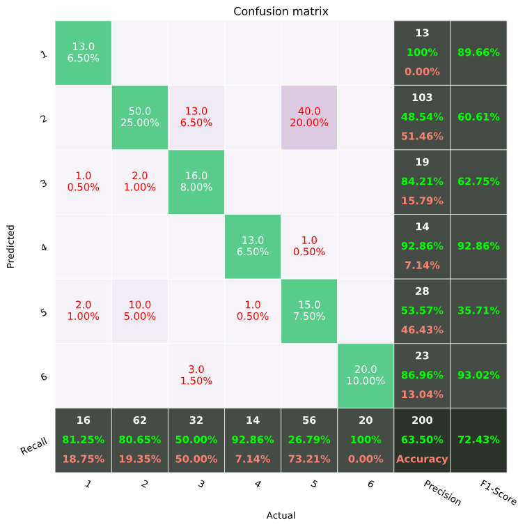

# Plot Confusion Matrix in Python

Plot a pretty confusion matrix (like Matlab) in python using seaborn and matplotlib

This module lets you plot a pretty looking confusion matrix from a np matrix or from a prediction results and actual labels.

Example plot:

